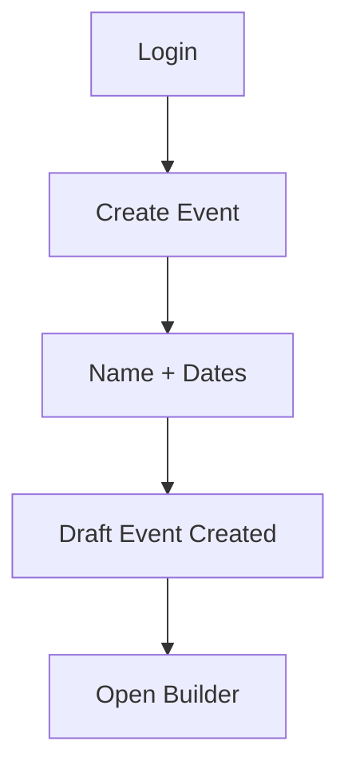
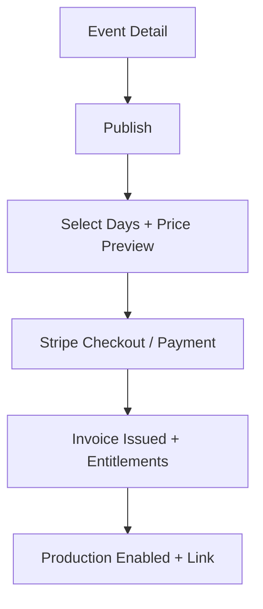
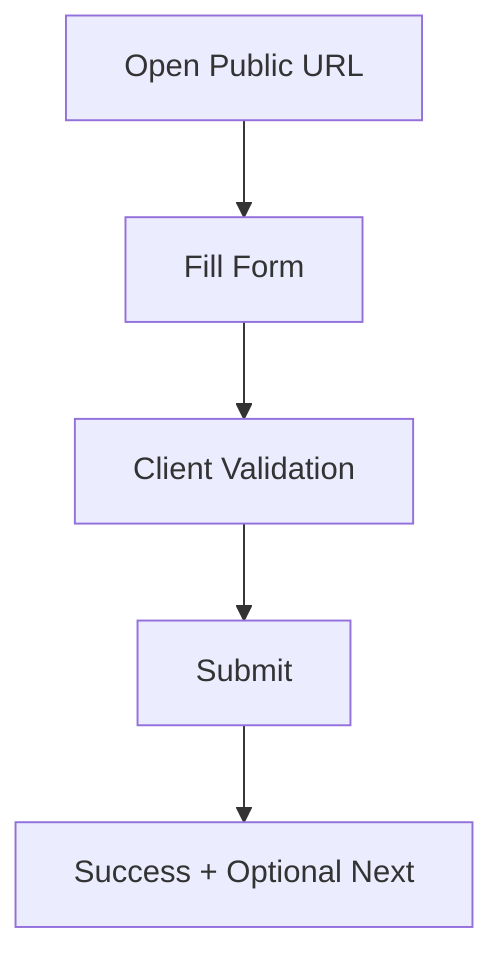
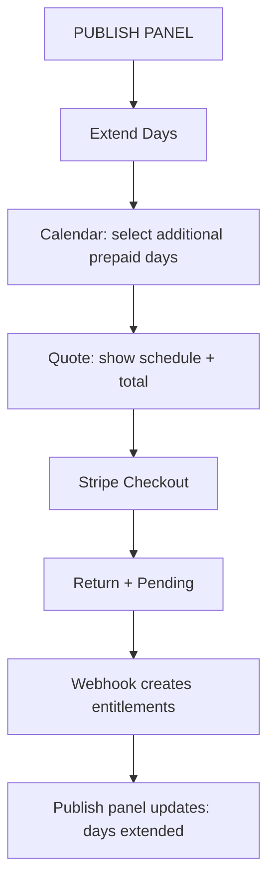
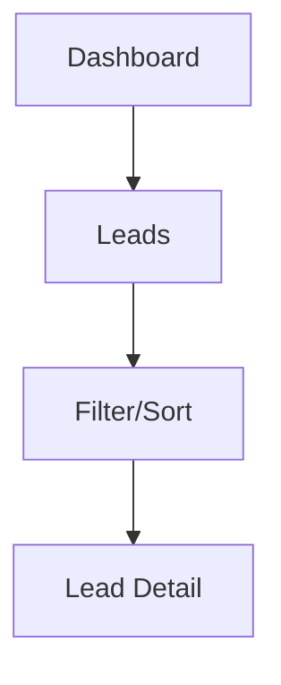

# Event Leads UI/UX Specification

This document defines the user experience goals, information architecture, user flows, and visual design specifications for Event Leads. It serves as the foundation for visual design and frontend development, ensuring a cohesive and user‑centered experience.

## Overall UX Goals & Principles

### Target User Personas
- Admin: Company owner or manager who configures billing, invites users, and publishes events.
- Event Staff: On‑site operators who need a reliable, easy form to capture leads quickly.
- Designer/Power User: Creates high‑fidelity form layouts with the desktop‑only Builder.

### Usability Goals
- First event created in under 10 minutes from signup to draft.
- Builder interactions feel precise; drag, snap, nudge, and align without frustration.
- Publishing is clear and gated with an obvious cost preview and confirmation.
- Lead capture flow is focused, resilient offline, and keyboard accessible.

### Design Principles
1. Clarity over cleverness: obvious controls, explicit states, predictable outcomes.
2. Progressive disclosure: show advanced builder controls only when relevant.
3. Consistent patterns: shared primitives (ShadCN), consistent spacing and motion.
4. Immediate feedback: drag/snap highlights, save status, publish confirmations.
5. Accessible by default: labels, focus rings, contrast, and ARIA where needed.

### Change Log
| Date | Version | Description | Author |
|------|---------|-------------|--------|
| 2025‑09‑14 | v0.1 | Initial consolidated spec from PRD/Architecture/UX shard | UX Expert |

## Information Architecture (IA)

### Site Map / Screen Inventory
```mermaid
flowchart TD
  LAND[Marketing Landing] --> AUTH[Sign Up / Login];
  LAND --> TRYDEMO[Try the Builder (Demo, no save)];
  AUTH --> DASH[Dashboard];
  DASH --> EVENTS[Events];
  EVENTS --> ED[Event Detail];
  ED --> B[Form Builder (Desktop‑only)]
  ED --> P[Publish];
  ED --> R[Leads];
  DASH --> U[Users & Invites];
  DASH --> BILL[Billing & Invoices];
  DASH --> SET[Settings];
  EXT[Public Form URL] --> LC[Lead Capture];
```

### Navigation Structure
- Primary: Dashboard, Events, Leads, Billing, Users, Settings
- Secondary (contextual within Event Detail): Overview, Builder, Leads, Publish
- Breadcrumbs: Dashboard > Events > {Event Name} > {Section}

## User Flows

### New User Journey
```mermaid
flowchart TD
  LAND[Landing] -->|Primary CTA| DEMO[Try Builder (Demo)];
  LAND -->|Secondary CTA| AUTH[Login / Sign Up];
  DEMO --> PLAY[Play with canvas & fields];
  PLAY -->|Attempt Save/Approve| AUTH;
  AUTH -->|Signup| VERIFY[Verify Email];
  VERIFY --> DASH[Dashboard];
  AUTH -->|Login| DASH;
  DASH --> CREATE_EVENT[Create Event];
  CREATE_EVENT --> OPEN_BUILDER[Open Builder];
  OPEN_BUILDER --> PREVIEW[Preview];
  PREVIEW --> TEST_SUBMIT[Submit test lead];
  TEST_SUBMIT --> READY[Set Ready for Review];
  READY --> ENABLE_PROD[Enable Production];
  ENABLE_PROD --> PROD_LINK[Production Link];
```

### Onboarding (First Logins)
- Show a dismissible onboarding wizard on the first few logins (until user dismisses).
- Highlights: Create Event, Builder, Preview/Test, Enable Production, View Leads.
- Store dismissal state per user; allow relaunch from Help menu.

### Create Event


### Design Form (Builder)
```mermaid
flowchart TD
  B0[Open Builder] --> B1[Add Fields]
  B1 --> B2[Drag/Resize on 16:9 Canvas]
  B2 --> B3[Snap to Grid/Edges]
  B3 --> B4[Set Properties (label, required, options)]
  B4 --> B5[Device Previews: Desktop/Tablet/Mobile]
  B5 --> B6[Preview Mode (read‑only, prod render path)]
  B6 --> B7[Save Draft]
```

### Publish & Billing


#### Production Link & Event-Day Enforcement
- Production link becomes available after payment (status → ProductionEnabled).
- Submissions are allowed only on prepaid event days. Outside those days, show a friendly message and disable submit.
- Multi-day events: allow submissions on any purchased day within the event date range (uses event timezone).

#### Billing Policy (Per Event Day)
- Prepaid entitlements: charge when enabling Production for selected day(s) using this schedule:
  - Day 1: $50; Day 2: +$40; Day 3: +$30; Day 4: +$20; Day 5: +$10; Day 6+: +$10/day.
- Extensions: allow purchasing additional days later; UI shows running total and already purchased days.
- Edge cases: no proration for partial days; all checks computed in event timezone.

### Lead Capture (Public)

- Event-day guard: If not a prepaid day, show disabled state and message with next valid date.
- Test vs Production: Public URL always records production submissions; Preview uses test mode.

### Extend Days (Admin-only)



Acceptance Criteria
- Only Admins can extend days and initiate payment.
- Calendar shows event date range with already-purchased days highlighted; disabled outside event window.
- Quote lists per-day prices and total; includes timezone and currency.
- After payment, UI shows "Payment Pending" until webhook confirms entitlements, then updates state.
- If production had elapsed, new entitlements reactivate submissions only on purchased future days.
- Error states: failed payment shows actionable retry; webhook timeout shows manual refresh/check status.

UI Details
- Calendar with multi-select and legend: Purchased, Available, Unavailable.
- Summary panel: Selected days, Schedule prices, Total, CTA "Proceed to Payment".
- History: List of past extensions with invoice links.

### Review Leads


## Builder Specification

### Canvas & Layouts
- Aspect: 16:9 default design size (e.g., 1920×1080); scale view as needed.
- Devices: Desktop (authoring target), Tablet, Mobile previews (read‑only).
- Grid: 8px base; optional snap; keyboard nudge 1px, Shift+nudge 8px.
- Constraints: Objects cannot leave canvas bounds.

### Properties Panel
- Common: x, y, w, h, z‑index, visibility.
- Field‑specific: label, export label, required, default, placeholder, help.
- Dropdowns: options list with default selection.
- Tab Order: auto by top‑left; manual override per object.

### Layers & Locking
- Z‑order management; lock/unlock; show/hide.

### Backgrounds
- Per‑form background image with zoom/position.
- Optional canvas background color when no image.

### Preview & Publish Guarantees
- Preview uses same render path as public form; prevents drift.
- Publishing creates immutable render snapshot bound to event revision.

### Form Status & Gating
- Statuses: Draft → Ready for Review → Production Enabled.
- Transition Draft → Ready for Review: user indicates readiness.
- Gating requirement: Before enabling Production, user must open Preview and submit at least one test lead successfully.
- After gating is satisfied, enable Production to generate the Production Link.
- Test submissions are flagged `test=true`; never mixed with production in reports by default.

### Try the Builder (Demo)
- Accessible from Landing without auth; no persistence or save/export.
- Limited feature set: canvas, palette, properties; disable Save/Approve/Publish.
- Any attempt to save/approve prompts Login/Sign Up; returns user to Builder with state reset.

## Component Inventory (Initial)

### Global
- AppShell: topbar, sidebar nav, content area.
- Toast/Alerts: success, warning, error, info.

### Builder
- Canvas: zoom controls, rulers (future), grid toggle, device switcher (preview only for non‑desktop).
- Toolbar: select, move, align, distribute, snap toggle, undo/redo.
- PropertiesPanel: field/selection inspector with tabs (Properties, Layout, Accessibility).
- FieldPalette: Text, Dropdown, Checkbox; extensible registry for new kinds.

### Event Management
- EventList: table/cards with status, dates, actions.
- EventDetail: tabs (Overview, Builder, Leads, Publish).
- PublishPanel: pricing preview, confirmation, terms.
 - Permissions: Admin can publish/archive/delete/restore; Users can create/edit events but cannot publish or delete.

### Event Metadata
- Required at create: name, date range (start/end), timezone.
- Optional: location, description, tags, expected attendance.
- Used for: dashboard summaries, event-day submission gating, billing schedule.

### Leads
- LeadList: table with filters; export CSV.
- LeadDetail: payload view with field labels.
- Filters include test vs production; default excludes test data unless toggled.
 - Permissions: CSV export is Admin-only; hide/disable for Users.

## Visual Design

### Color System (Tailwind tokens)
- Primary: brand‑primary 600 for actions; 700 on hover.
- Surface: neutral 50/100 backgrounds; 900 for text; 500 for secondary text.
- Status: success/emeral­d; warning/amber; danger/red; info/sky.
- Accessibility: enforce 4.5:1 for text on surfaces; 3:1 for large text.

### Typography
- Family: system UI or Inter.
- Scale: H1 32/40, H2 24/32, H3 20/28, Body 16/24, Small 14/20.
- Weight: Headings 600; body 400/500.

### Iconography
- Library: Lucide (via ShadCN).
- Usage: pair with labels; avoid icon‑only actions unless universally recognized.

### Spacing & Layout
- Grid: 8px spacing scale (4, 8, 12, 16, 24, 32, 40, 64).
- Containers: max‑w‑screen‑xl; content gutters 24px.

## Accessibility Requirements
- Standard: WCAG 2.1 AA target.
- Visual: contrast defaults; visible focus rings; scalable text.
- Interaction: full keyboard use; ARIA roles on interactive builder controls.
- Content: semantic headings; associated labels (`for`/`id`); alt text on imagery.

## Responsiveness Strategy
- Builder: desktop‑only authoring; responsive previews supported.
- Breakpoints: Mobile <640, Tablet 640–1024, Desktop 1024–1440, Wide ≥1440.
- Adaptations: collapse nav on mobile; prioritize primary actions; simplify tables to cards on small screens.

## Animation & Micro‑interactions
- Motion principles: subtle, purposeful, 150–250ms; prefer ease‑out; reduce‑motion respected.
- Key spots: drag hover/snap glow, selection handles, toast in/out, publish confirmation.

## Performance Considerations
- Targets: TTI < 2.5s on desktop; 60fps canvas interactions; sub‑100ms property panel updates.
- Strategies: code‑split builder; virtualize lists; memoize heavy components; offload expensive layout calc from render loop.

## UI States & Messaging
- Empty states: Dashboard (no events), Event Detail (no forms), Leads (no results); provide clear primary CTA and helpful secondary actions.
- Validation: Inline messages beneath fields; toast for global failures; avoid modal-only errors.
- Auth interstitials: Unverified account screen with Resend link and cooldown; password reset success with login CTA.
- Event-day guard: Show disabled submit with message “Submissions open on {date} ({tz}).” Include local time hint.
- Test vs Production: Badge on Preview (“Test Mode”); exclude test by default in lists with toggle.

## Keyboard Shortcuts (Builder)
- Arrow keys: nudge 1px; Shift+Arrow: nudge 8px.
- Ctrl/Cmd+C/V: copy/paste; Ctrl/Cmd+D: duplicate; Del: delete.
- Ctrl/Cmd+Z/Y: undo/redo; Ctrl/Cmd+G/U: group/ungroup (future).
- Ctrl/Cmd+S: save draft; P: toggle preview; G: toggle grid.

## Offline Support (Public Form)
- Strategy: Service worker caches form assets and schema; queue submissions in IndexedDB when offline; background sync when online.
- UX: Banner “Offline mode — submissions will sync when online.”; per-submission status until confirmed.
- Limits: Set max queue size; surface errors if queue is full.

## Internationalization & Timezones
- Locale: English (en-US) for MVP; design copy to be externalized for future i18n.
- Timezones: Display event times in event timezone with user local time hint where helpful.

## Accessibility Acceptance Criteria
- Keyboard: All interactive controls reachable and operable by keyboard; visible focus.
- Contrast: Meets WCAG 2.1 AA; verify on buttons, text on backgrounds, and canvas overlays.
- ARIA: Roles and labels on builder controls; name/role/state conveyed for selected objects.
- Forms: Labels associated (`for`/`id`), error text announced; tab order logical or overridable.

## Open Questions
1. Exact device preview resolutions to support by default.
2. Offline/poor-network capture guarantees for public form.
3. Undo/redo scope and persistence (per session vs stored).
4. Stripe product/price configuration per environment.

## Data Retention & Deletion
- Retention: Store event, form, and lead data as long as feasible.
- Archiving: Customers can archive events/forms to hide from active views; data remains retrievable.
- Deletion: Customer-initiated deletes perform soft-deletes; data hidden from UI but recoverable by admins.
- Scope: Applies to both production and test data.
- Compliance: Add audit trail for delete/restore actions; expose restore on request.

## Next Steps
1. Review this spec with stakeholders.
2. Lock device preview matrix; finalize accessibility defaults.
3. Prepare initial component sketches/wireframes in Figma.
4. Hand off to Dev/Architect to align component contracts and data shapes.
5. Design onboarding wizard content and dismissal UX.
6. Specify billing integration details for day-based pricing and event-day guard.
7. Define soft-delete/restore admin flows and permissions.
