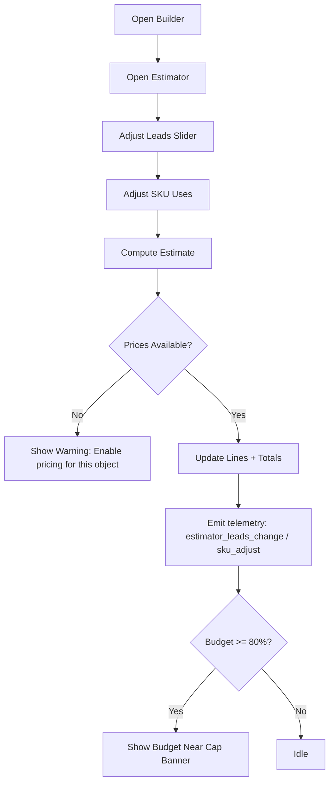
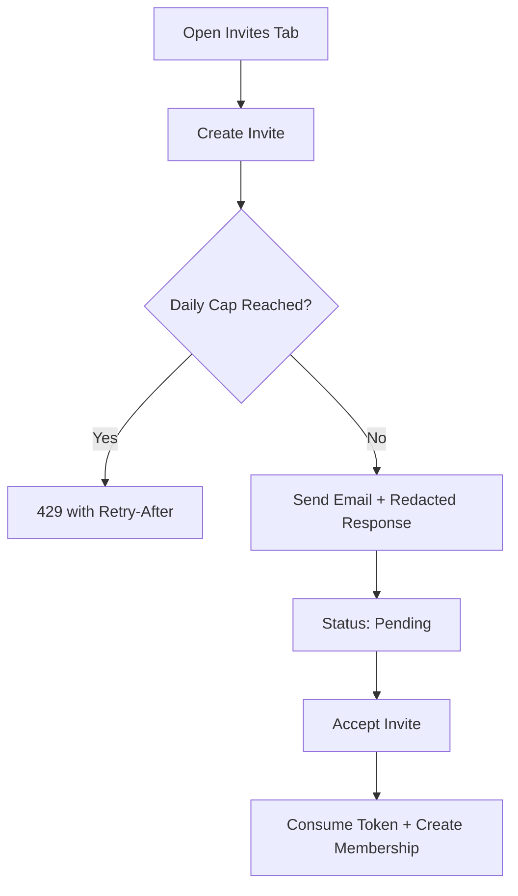
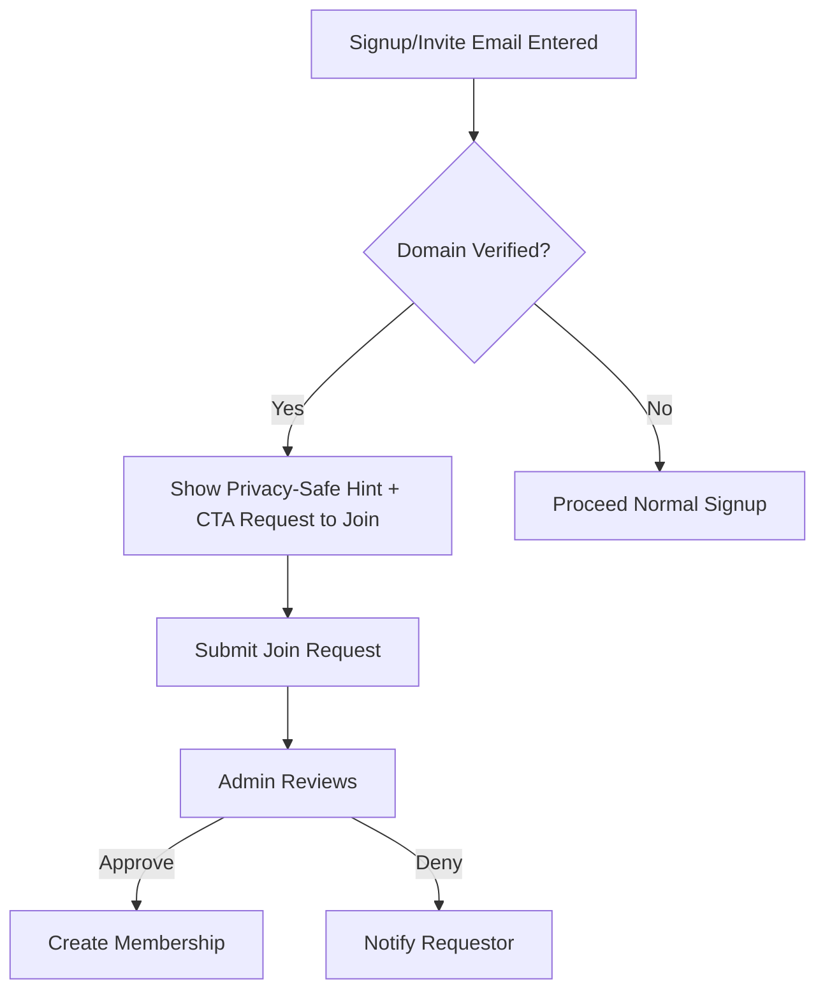

# Front-End Spec v2 — Event Builder Platform

Status: Active
Date: 2025-09-20

Shard refs: `docs/shards/01-builder-ux.md`
Cross‑docs: `docs/prd/v2-prd.md`, `docs/architecture/v2-architecture.md`

## Scope
This v2 front-end spec consolidates the UI/UX for the Builder, Events, Leads, Billing, Users, and the Enterprise Head Office Dashboard. It supersedes the prior spec and adds the enterprise dashboard as a first‑class, versioned shard.

## Information Architecture (IA)
- Site map and navigation remain as v1 with additions for enterprise dashboard and Assist Mode.
- See `docs/front-end-spec/head-office-dashboard.md` for enterprise IA and wireframes.

## Key UX Principles
- Precision builder interactions (drag/snap/nudge), predictable publish flow, and accessible public forms.
- Event‑day guard for production submissions; prepaid behaviors surfaced in Publish panel.

## Components & Screens (delta from prior)
- Builder: right‑rail estimator (100‑lead default, slider, per‑SKU lines) with budgets/caps warnings.
- Publish: day‑based pricing schedule and entitlements creation after payment.
- Head Office Dashboard: enterprise screens per shard.

## Accessibility & Telemetry (additions)
- Dashboard ARIA roles (`tree`, `status` for Assist banner), live regions for KPI updates.
- Events: `assist_start`, `assist_end`, `assign_plan`, `budget_update`, `domain_verify_*`, `estimator_open`.

## Acceptance Criteria
- Builder estimator accuracy matches Pricing Engine within tolerance.
- Dashboard performance targets: Org Tree <300ms for 100 nodes (cached).
- Consolidated billing matches ledger/metering aggregates for selected period.

## Links
- Dashboard UX shard: `docs/front-end-spec/head-office-dashboard.md`
- PRD v2: `docs/prd/v2-prd.md`
- Architecture v2: `docs/architecture/v2-architecture.md`

## Screens (Expanded)
- Dashboard
- Events: List, Detail (Overview, Builder, Leads, Publish)
- Builder: Canvas + Right‑rail Estimator
- Billing: Invoices, Publish panel
- Users & Invites: Invites | Join Requests | Domain Claims
- Administration: Model & Plan Assignment, Entitlement Inspector (System Admin)
- Enterprise: Head Office Dashboard (Overview, Billing, Subsidiary, Admin, Assist)

## Builder — Estimator Panel
- UI
  - Right rail, sticky; 100‑lead default; slider (10 → 10k) with keyboard support.
  - Per‑SKU lines: label, included vs overage, unit price, subtotal; base pack shown when applicable.
  - Totals row; badge for model/plan.
- Copy
  - “Costs scale with your results. Adjust objects/validations to tune cost.”
  - Warnings for prepaid requirements (SMS/validations).
- ARIA
  - Slider: `role="slider"` with `aria-valuemin`, `aria-valuemax`, `aria-valuenow`, `aria-valuetext`.
  - Totals updated via `aria-live="polite"` region.
- Telemetry
  - `estimator_open`, `estimator_leads_change`, `estimator_sku_adjust`, `estimator_export`.
- Error/Warnings
  - Missing price for SKU → inline alert: “Ask your admin to enable pricing for this object.”
  - Budget near cap → banner at 80% with CTA to review caps.
- Acceptance Criteria
  - Estimate matches Pricing Engine within tolerance for 10‑SKU matrix.
  - Keyboard interactions fully operable and announced.

## Administration — Model & Plan Assignment (System Admin)
- UI
  - Selectors for Model and Plan; Effective date/time; “Preview 100 leads” action.
  - Entitlement Inspector: shows diffs (e.g., included qty, overage price, tier changes).
  - Assign button with confirmation; audit badges for changes.
- Copy
  - “Assign Business Model & Plan (System Admin only). Changes are audited.”
- Telemetry
  - `assign_plan_open`, `assign_plan_preview`, `assign_plan_submit`.
- Acceptance Criteria
  - Diffs accurately reflect effective entitlements; preview reflects pricing rules.
  - Access restricted to System Admin; audited with actor and before/after JSON.

## Users & Invites — Tabs
- Tabs: Invites | Join Requests | Domain Claims
- Invites
  - Table with search, bulk select (resend, revoke), status (pending/accepted/expired), rate‑limit badge.
  - Create Invite form; redacted responses; TTL/daily caps surfaced.
- Join Requests
  - List of requests with domain match; actions: approve/deny; privacy‑safe (no member names leaked).
- Domain Claims
  - Table: domain, status (pending/verified/revoked/pending_conflict), wildcard flag, verify action.
  - Bulk actions where safe (revoke); audit badges for changes.
- Search & Bulk
  - Debounced search; multi‑select; undo toasts on reversible actions.
- Acceptance Criteria
  - Invite uniqueness enforced per `(org_id, lower(email))` pending; 429 on caps with Retry‑After.
  - Join Requests never reveal member identities; CTA to approve/deny routes correctly.
  - Domain Claims actions reflect DMARC results and update statuses; wildcard only post root verify + Owner + 2FA.

## Domain Claims — Email Challenge Flow
- Steps
  1) Admin enters domain; system sends email challenge.
  2) On receipt, backend validates DKIM/SPF and DMARC alignment; stores hashed header `proof`.
  3) UI updates status; shows verify/retry actions; conflict moves to `pending_conflict`.
- Instructions
  - “Send from an address at your domain. We verify DMARC alignment; IT may need to adjust SPF/DKIM.”
- Wildcard Control
  - Disabled until root verified; enabling shows guardrails note and requires Owner + 2FA.
- Errors
  - “We couldn’t verify mail is from your domain. Try a different sender or contact IT.”
- Acceptance Criteria
  - Clear status transitions; proof not exposing PII; guardrails enforced for wildcard.

## P1 Private Suggestions — Join CTA
- Behavior
  - On signup or invite entry, if email domain matches a verified org, show a privacy‑safe hint and CTA “Request to Join”.
  - Never show member names or counts.
- Copy
  - “We found a similar company. Request to join?”
- Acceptance Criteria
  - Hints only display for verified domains; CTA posts Join Request and confirms without disclosing members.

## Partner Directory (P2)
- Placeholder screen with opt‑in settings; search and profile edit behind feature flag.
- Acceptance Criteria
  - Hidden by default; requires explicit opt‑in; no identity leakage across orgs.

## Head Office Dashboard (Merged Summary)
- Includes: Org Tree, KPI cards, Subsidiary Grid, Consolidated Billing, Subsidiary Detail, Assist Mode, Model & Plan Assignment, Budgets & Caps, Domain Claims across group.
- ARIA & Telemetry
  - `role="tree"` with keyboard expand/collapse; Assist banner `role="status"`.
  - Events: `assist_start`, `assist_end`, `assign_plan`, `budget_update`, `domain_verify_*`, `subsidiary_row_action`.
- Billing View
  - Allocation strategies: absorb | chargeback | split (%); group by org and optional cost center; PoR precedence badge.
- Acceptance Criteria
  - Org Tree <300ms for 100 nodes (cached); KPIs and consolidated billing equal ledger/metering; Assist actions audited.
- See also: `docs/front-end-spec/head-office-dashboard.md` for full wireframes and annotations.

## Content Strings (Selected)
- Estimator warning: “Ask your admin to enable pricing for this object.”
- Assist banner: “You are assisting {org} as {head_office}. All actions are audited.”
- Domain error: “Verification failed (DMARC mismatch). Try a different sender.”

## Flow Diagrams (References)
- Builder Estimator interactions
- Admin Assignment preview → assign
- Users & Invites tab flows (create invite, approve join, verify domain)

Shard refs: `docs/shards/01-builder-ux.md`, `docs/shards/02-data-schema.md`, `docs/shards/03-billing-go-live.md`, `docs/shards/04-auth-rbac.md`

## Flow Diagrams (Mermaid)

### Builder — Estimator Interactions


### Administration — Model & Plan Assignment
```mermaid
flowchart TD
  A[Open Assignment (SysAdmin)] --> B[Select Model]
  B --> C[Select Plan]
  C --> D[Set Effective At]
  D --> E[Preview 100 Leads]
  E --> F[Show Entitlement Diffs]
  F --> G{Confirm Assign?}
  G -- Yes --> H[Persist Assignment + Overrides]
  H --> I[Audit Actor/Before/After]
  G -- No --> J[Cancel]
```

### Users & Invites — Create Invite


### Users & Invites — Join Requests (Private Suggestion)


### Domain Claims — Email Challenge
```mermaid
flowchart TD
  A[Enter Domain] --> B[Send Email Challenge]
  B --> C[Receive Email]
  C --> D[Validate DKIM/SPF + DMARC Alignment]
  D --> E{Aligned?}
  E -- Yes --> F[Status: Verified + Proof Stored (hashed headers)]
  E -- No --> G[Status: Pending/Retry]
  D --> H{Conflict?}
  H -- Yes --> I[Status: pending_conflict + Escalation]
  F --> J{Enable Wildcard?}
  J -- Require Owner+2FA --> K[Enable Wildcard]
```

### Partner Directory (P2 Placeholder)
```mermaid
flowchart TD
  A[Admin Opt-In] --> B[Edit Partner Profile]
  B --> C[Directory Search (P2)]
  C --> D[Contact via Platform]
```

### Head Office Dashboard — Assist Mode
```mermaid
flowchart TD
  A[Open Dashboard] --> B[Start Assist Session]
  B --> C[Enter Purpose + Duration]
  C --> D[Banner Visible (role="status")]
  D --> E[Perform Actions (Audited actor+target)]
  E --> F[End Assist]
```

### Billing — Consolidated Invoice & Allocation
```mermaid
flowchart TD
  A[Select Billing Account] --> B[Load Consolidated Invoice]
  B --> C[Choose Allocation: absorb | chargeback | split]
  C --> D[Group by Org + Cost Center]
  D --> E{Billing Account PoR Exists?}
  E -- Yes --> F[Show PoR Precedence Badge]
  E -- No --> G[Use Per-Line Org PoR]
  D --> H[Export CSV/PDF]
```

## Telemetry Event IDs (Canonical)
- estimator_open, estimator_leads_change, estimator_sku_adjust, estimator_export
- assign_plan_open, assign_plan_preview, assign_plan_submit
- invite_create, invite_accept, invite_rate_limited
- domain_verify_attempt, domain_verify_success, domain_verify_conflict
- assist_start, assist_end
- subsidiary_row_action, budget_update

## Error & Copy States (Consolidated)
- Domain Claims
  - Failed alignment: “Verification failed (DMARC mismatch). Try a different sender.”
  - Conflict: “Another organization appears to control this domain. We’ve flagged this for review.”
- Invites
  - Rate limit: “You’ve reached today’s invite limit. Try again in {retry_after}.”
  - Expired/Consumed: “This invitation link is no longer valid.”
- Estimator
  - Missing price: “Ask your admin to enable pricing for this object.”
  - Budget near cap: “You’re nearing your budget cap. Review caps to avoid interruptions.”
- Action Services
  - Retry in progress: “We’re retrying this action. We’ll let you know if we can’t deliver.”
  - DLQ surfaced: “This action couldn’t be delivered and requires attention. See Admin Logs.”
