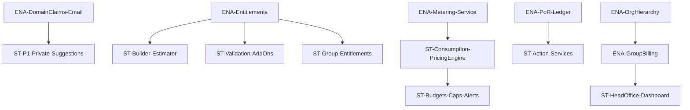

# Stories — v2 Plan (Overview, Swimlanes, Dependencies, Status)

Status: Active
Date: 2025-09-20

Cross-docs: `docs/prd/v2-prd.md`, `docs/architecture/v2-architecture.md`

## Overview & Swimlanes

- Foundations (Enablers)
  - ENA-DomainClaims-Email
  - ENA-PoR-Ledger
  - ENA-Entitlements
  - ENA-Metering-Service
  - ENA-OrgHierarchy
  - ENA-GroupBilling

- Consumption UX & Billing
  - ST-Builder-Estimator
  - ST-Consumption-PricingEngine
  - ST-Budgets-Caps-Alerts
  - ST-Validation-AddOns
  - ST-Action-Services

- Privacy & Discovery
  - ST-P1-Private-Suggestions
  - ST-P2-Partner-Directory

- Enterprise
  - ST-HeadOffice-Dashboard
  - ST-Assist-Mode
  - ST-Group-Entitlements

## Dependency Graph

## Status Table (Authoritative)

Columns: ID, Title, Lane, Requires, Owner, Status {Planned|InProgress|Blocked|Review|Done}, Flag, Notes

| ID | Title | Lane | Requires | Owner | Status | Flag | Notes |
| --- | --- | --- | --- | --- | --- | --- | --- |
| ENA-DomainClaims-Email | Email-based Domain Claims (DMARC) | Foundations | – | **Architect** | InProgress | `flag:domain_claims` | Blocker for invite/join |
| ENA-PoR-Ledger | Partner-of-Record + Ledger | Foundations | – | **Billing Dev Lead** | Planned | `flag:por_ledger` | Enables commissions |
| ENA-Entitlements | Plans & SKU Catalog | Foundations | – | **Architect** | Planned | `flag:entitlements` | Needed for estimator |
| ENA-Metering-Service | Metering ingest + idempotency | Foundations | ENA-Entitlements | **Billing Dev Lead** | Planned | `flag:metering` | Needed for pricing |
| ST-Builder-Estimator | Estimator panel | Consumption | ENA-Entitlements | **Frontend Lead** | Planned | `flag:estimator` | Shows 100-lead default |
| ST-Consumption-PricingEngine | Pricing from metering → ledger | Consumption | ENA-Metering-Service | **Billing Dev Lead** | Planned | `flag:pricing_engine` | Nightly + on-demand |
| ST-Budgets-Caps-Alerts | Budgets/alerts/caps | Consumption | ST-Consumption-PricingEngine | **Billing Dev Lead** | Planned | `flag:budgets_caps` | Guardrails |
| ST-Validation-AddOns | Email/Address/Phone checks | Consumption | ENA-Entitlements | **Billing Dev Lead** | Planned | `flag:validations` | Prepaid SMS |
| ST-Action-Services | Email/SMS/DocGen/Webhook retries | Consumption | ENA-PoR-Ledger | **Billing Dev Lead** | Planned | `flag:actions` | Per-run billing |
| ST-P1-Private-Suggestions | Private de-dup hints | Privacy | ENA-DomainClaims-Email | **Frontend Lead** | Planned | `flag:private_suggestions` | No identity leak |
| ST-P2-Partner-Directory | Partner-visible directory | Privacy | ENA-Entitlements | **Frontend Lead** | Planned | `flag:partner_directory` | Opt-in |
| ENA-OrgHierarchy | Org closure + APIs | Enterprise | – | **Architect** | Planned | `flag:org_hierarchy` | For group billing |
| ENA-GroupBilling | Billing account + mapping | Enterprise | ENA-OrgHierarchy | **Billing Dev Lead** | Planned | `flag:group_billing` | Consolidated invoice |
| ST-HeadOffice-Dashboard | Enterprise dashboard | Enterprise | ENA-OrgHierarchy, ENA-GroupBilling | **Frontend Lead** | Planned | `flag:dashboard` | Assist mode, KPIs |
| ST-Assist-Mode | Assist Mode | Enterprise | ENA-OrgHierarchy | **Frontend Lead** | Planned | `flag:dashboard` | Session banner + audit |
| ST-Group-Entitlements | Group Entitlements | Enterprise | ENA-Entitlements | **Architect** | Planned | `flag:group_billing` | Inheritance + overrides |

## Critical Path & Sprint Plan

- Sprint N: ENA-DomainClaims-Email, ST-P1-Private-Suggestions
- Sprint N+1: ENA-PoR-Ledger, ENA-Entitlements
- Sprint N+2: ENA-Metering-Service, ST-Consumption-PricingEngine, ST-Validation-AddOns
- Sprint N+3: ST-Action-Services, ST-Budgets-Caps-Alerts
- Sprint N+4: ENA-OrgHierarchy, ENA-GroupBilling, ST-HeadOffice-Dashboard, ST-Group-Entitlements

## WIP & Policy

"One story InProgress per dev; enablers before dependents; docs updated in same PR (DoD)."

Links: `docs/checklists/DoR-Data.md`, `docs/checklists/DoD-Data.md`.

## Migrations & Flags

- Alembic order:
  1) domain_claims
  2) por_commission_ledger
  3) business_model_entitlements
  4) metering_events
  5) org_hierarchy_and_billing_accounts

- Feature flags:
  - flag:domain_claims
  - flag:private_suggestions
  - flag:por_ledger
  - flag:entitlements
  - flag:metering
  - flag:pricing_engine
  - flag:budgets_caps
  - flag:validations
  - flag:actions
  - flag:org_hierarchy
  - flag:group_billing
  - flag:dashboard
  - flag:estimator

## Mapping Snapshot

- See `docs/stories/mapping.csv`
- Summary: 15 legacy → 13 v2 stories; 7 with deltas

## Risks & Mitigations

- Metering drift → nightly reconciliation + anomaly alerts; idempotent ingest safeguards
- Partner disputes → PoR precedence + audit + dispute tooling; reversible ledger entries
- Cost spikes → budgets, caps, prepaid credits; block at adapters; admin override path

## Board Link

- Project board (filtered to v2 labels): (set by PM)

## Labeling & Naming

- Labels: `v2`, `lane:foundations|consumption|privacy|enterprise`, `type:enabler|feature`, `flag:<name>`
- Branch: `feature/v2-<story-id>-<slug>`
- PR template: DoR/DoD checkboxes + "Docs updated (ADR/PRD/Spec)" tick
