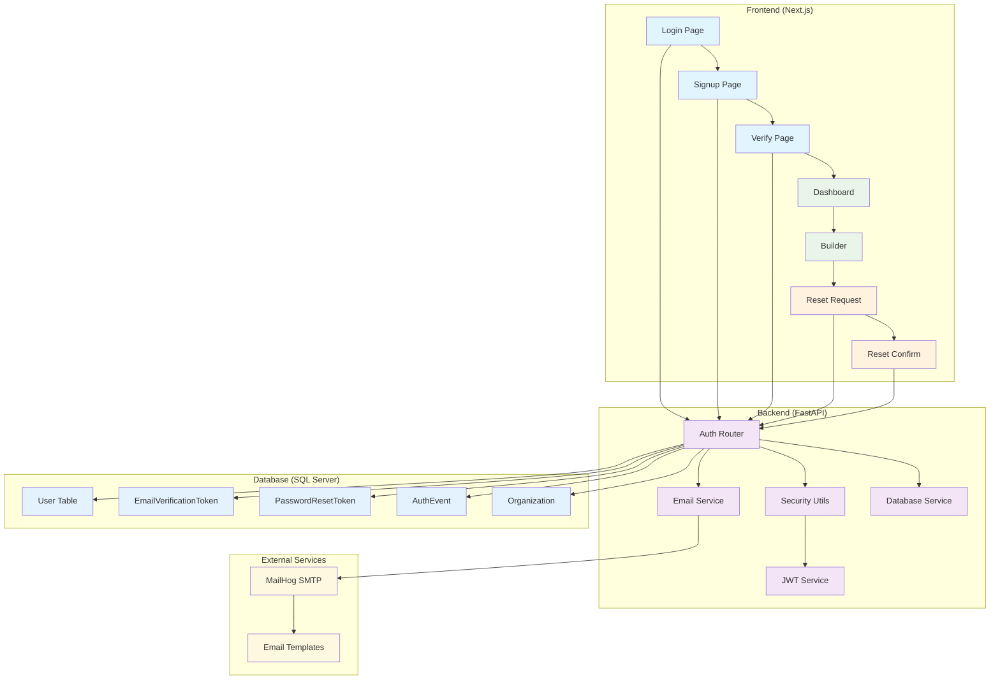
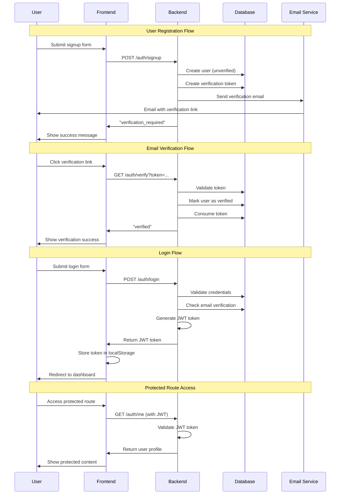
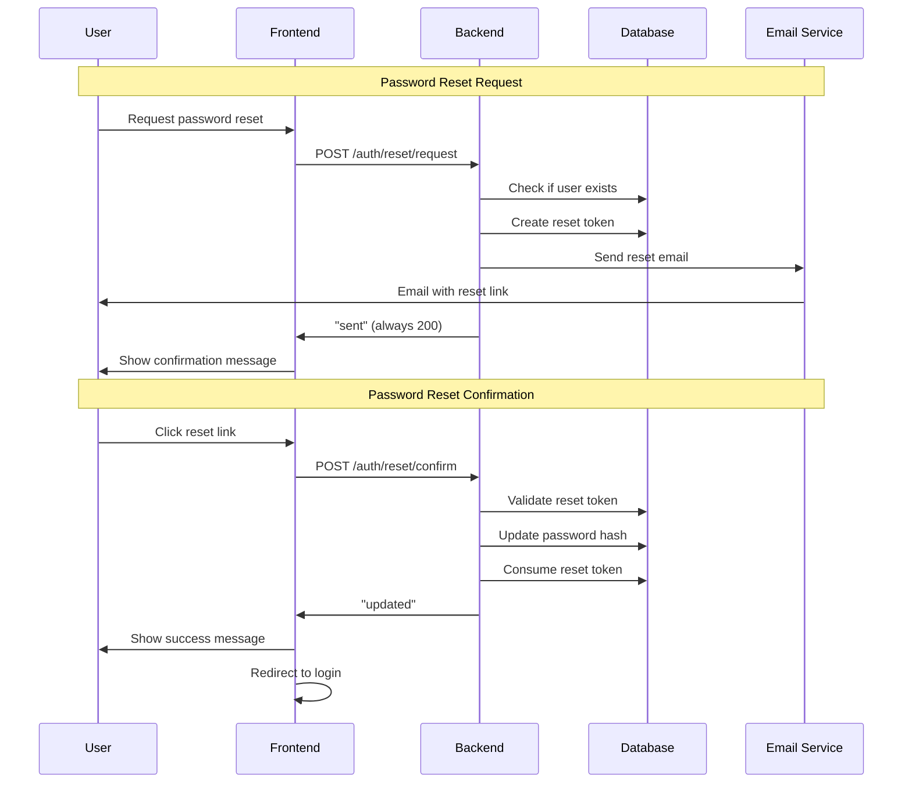
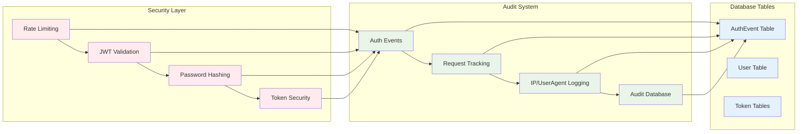
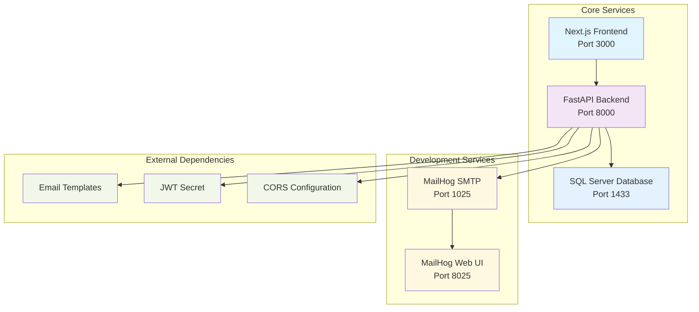

# Story 0001 - Authentication Flow & Services Diagram

## System Architecture Overview

## Authentication Flow Sequence

## Password Reset Flow

## Security & Audit Flow

## Service Dependencies

## Key Components Summary

### Frontend Services
- **Authentication Pages**: Login, Signup, Verify, Reset
- **Protected Routes**: Dashboard, Builder
- **Token Management**: JWT storage and validation
- **API Integration**: RESTful API calls to backend

### Backend Services
- **Auth Router**: All authentication endpoints
- **Security Utils**: Password hashing, JWT handling
- **Email Service**: SMTP integration with MailHog
- **Database Service**: User and token management
- **Audit Service**: Comprehensive logging

### Database Schema
- **User Table**: Core user information
- **Token Tables**: Email verification and password reset
- **Audit Table**: Security event logging
- **Organization Table**: Multi-tenant support

### External Services
- **MailHog**: Development email server
- **SQL Server**: Primary database
- **JWT**: Token-based authentication
- **CORS**: Cross-origin resource sharing

This architecture provides a complete, secure, and scalable authentication system ready for UAT testing.
